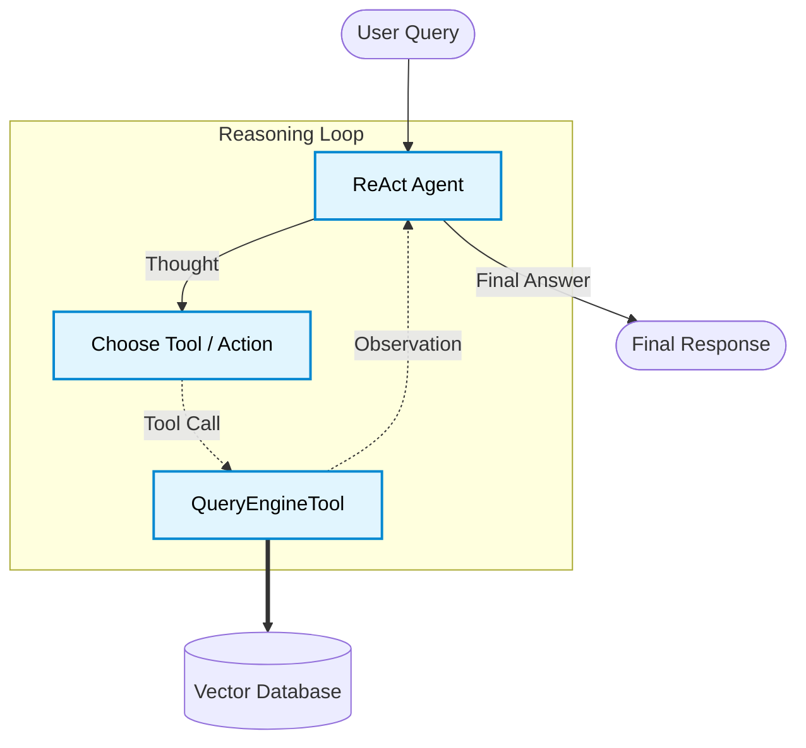

# Agentic RAG: Building Autonomous Research Agents with LlamaIndex


In previous posts, we explored how to break apart monolithic RAG applications using [Modular RAG architectures](https://gen-lang-client-0570044087-8ff3f.web.app/blog/post?slug=Modular-RAG-A-Flexible-Pipeline-Architecture) and how to improve retrieval accuracy using [Advanced RAG techniques](https://gen-lang-client-0570044087-8ff3f.web.app/blog/post?slug=Beyond-Naive-RAG-with-HyDE-Reranking-and-SubQuestions) like HyDE and Cross-Encoder Re-ranking.

While these enhancements drastically improve the quality of our responses, they fundamentally remain **pipelines**: fixed paths of execution where data flows from retrieval to synthesis in a predetermined sequence.

But what if a question requires querying multiple, independent data sources? What if the initial retrieval isn't sufficient and the system needs to try a different search strategy?

This is where **Agentic RAG** comes in. By upgrading our pipeline to an **Agent**, we give the LLM the autonomy to reason about the user's query, dynamically select which tools to use, observe the results, and iteratively decide the next best action.

---

## The ReAct Paradigm

The core engine powering many of these autonomous systems is the **ReAct (Reasoning and Acting)** framework. Instead of a linear flow, a ReAct agent operates in a continuous loop:


1. **Thought**: The agent analyzes the query and decides on a plan.
2. **Action**: The agent selects a specific tool (e.g., a query engine, a web search API, or a calculator) and provides it with parameters.
3. **Observation**: The agent reads the output of the tool.
4. **Repeat**: The agent evaluates if it has enough information to answer the original query or if it needs to use another tool.

Here is a conceptual look at how an Agent replaces the fixed RAG pipeline:



Let's look at how easily we can build this using LlamaIndex and Google's Gemini 2.5 Flash.

---

## 1. Establishing the Baseline RAG Tools

Before we can build an agent, we need tools for it to use. In a RAG context, our primary tools are `QueryEngines` connected to our vector databases.

We start by setting up our environment exactly as we did for our standard pipelines using a local HuggingFace embedding model to save on API costs and `gemini-2.5-flash` for the LLM.

```python
from llama_index.core import Settings, VectorStoreIndex, SimpleDirectoryReader
from llama_index.llms.google_genai import GoogleGenAI
from llama_index.embeddings.huggingface import HuggingFaceEmbedding

# 1. Configure the LLM and Local Embeddings
Settings.llm = GoogleGenAI(model="gemini-2.5-flash")
Settings.embed_model = HuggingFaceEmbedding(model_name="BAAI/bge-small-en-v1.5", device="cuda")

# 2. Build the Index and Query Engine
print("Loading Data...")
documents = SimpleDirectoryReader("data").load_data()

print("Building Index...")
index = VectorStoreIndex.from_documents(documents)
query_engine = index.as_query_engine(similarity_top_k=3)
```

---

## 2. Wrapping Query Engines as Tools

To make our query engine accessible to the agent, we must wrap it in a `QueryEngineTool`. This is a critical step: we must provide a precise `description`. The agent relies entirely on this metadata to understand _when_ and _why_ it should use this specific tool.


```python
from llama_index.core.tools import QueryEngineTool, ToolMetadata

vector_tool = QueryEngineTool(
    query_engine=query_engine,
    metadata=ToolMetadata(
        name='modular_rag_blog_post',
        description='Useful for answering questions about the Modular RAG blog post.'
    )
)
```

If we had multiple documents say, one for financial reports and another for HR policies we would create separate query engines and wrap them as distinct tools, allowing the agent to route queries appropriately.

---

## 3. Initializing the ReAct Agent

With our tools defined, creating the agent in LlamaIndex is remarkably straightforward. We pass our list of tools and our LLM to the `ReActAgent`.

```python
from llama_index.core.agent import ReActAgent

# Initialize the ReAct Agent
agent = ReActAgent(tools=[vector_tool], llm=Settings.llm, verbose=True)

# Run the agent
response = agent.run("What is this document about?")
print(str(response))
```

---

## Peeking Under the Hood: The Agent's Thought Process

Because we initialized the agent with `verbose=True` (and tapped into LlamaIndex's event streams), we can actually observe the ReAct loop in action.

When we ask, _"What is this document about?"_, the agent doesn't blindly trigger a similarity search. It thinks:

```text
[run_agent_step] started from AgentSetup
Observation: The document is about Modular RAG, a new approach to Retrieval Augmented Generation that enhances the capabilities of Large Language Models by integrating various modules for different stages of the RAG pipeline...
Thought: I can answer without using any more tools. I'll use the user's language to answer.
Answer: This document is about Modular RAG (Retrieval Augmented Generation). It discusses how Modular RAG improves upon traditional RAG by integrating various modules...
```

The LLM analyzed the query, matched it to the `modular_rag_blog_post` tool's description, executed the retrieval, read the observation, and consciously decided it had enough context to stop and synthesize the final answer.

---

## The Power of Agency

While our example uses a single tool, the true power of Agentic RAG unlocks when you provide the agent with a diverse toolkit:


- **Multiple Query Engines:** Routing between distinct knowledge bases.
- **Web Search APIs:** Falling back to the public internet if internal retrieval fails.
- **Calculator Tools:** Performing exact math on retrieved financial data rather than relying on the LLM's inherently flawed arithmetic.

By shifting from fixed pipelines to autonomous agents, we create highly resilient, intelligent RAG systems capable of handling the messy, complex queries that occur in the real world.
