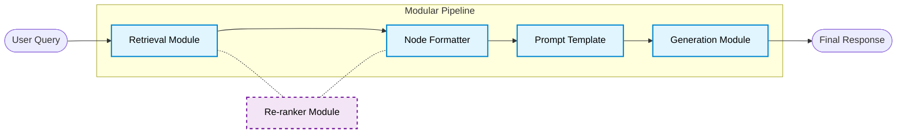

# Breaking the Monolith: Embracing Modular RAG Architectures


In the rapidly evolving world of Large Language Models, the initial approach to Retrieval-Augmented Generation (RAG) was often monolithic. We would load our documents, build a simple index, and let a high-level wrapper handle the rest. While "Naive RAG" is fantastic for prototyping, it becomes a bottleneck as your application scales in complexity.

What happens when you need to swap your vector database? Or introduce a re-ranker? Or conditionally route queries based on their intent?

Enter **Modular RAG**. Modular RAG isn't a single technique; it's an architectural paradigm shift. It breaks the retrieval and generation process into distinct, interoperable modules. This allows developers to construct highly customized pipelines tailored exactly to their use cases.

Here is a conceptual look at how a Modular RAG architecture replaces the monolithic approach:



---

## Moving Away from the Monolith

In earlier iterations with LlamaIndex, getting a query engine up and running took three lines of code:

```python
# The Monolithic Approach
index = VectorStoreIndex.from_documents(documents)
query_engine = index.as_query_engine()
response = query_engine.query("What are the environmental goals?")
```

This is incredibly powerful, but much of the logic—how the nodes are formatted, the exact prompt being used, the ordering of operations—is hidden under the hood. 

Let's break this monolith apart using LlamaIndex's `QueryPipeline`.

---

## 1. Explicit Ingestion and Indexing

Instead of blindly feeding documents into an index, we explicitly define our parsing logic. This gives us the flexibility to implement custom semantic chunking, add metadata extractors, or filter nodes before they ever reach the vector database.

```python
from llama_index.core import SimpleDirectoryReader, VectorStoreIndex
from llama_index.core.node_parser import SentenceSplitter

# Load documents
documents = SimpleDirectoryReader("data").load_data()

# Explicitly define our parsing module
splitter = SentenceSplitter(chunk_size=512, chunk_overlap=50)
nodes = splitter.get_nodes_from_documents(documents)

# Build the vector store module
index = VectorStoreIndex(nodes)
```

---

## 2. Defining the Modules

Next, we define the individual components that will make up our pipeline. We need a retriever, a prompt template, and a utility function to format our retrieved nodes.

```python
from llama_index.core import PromptTemplate
from llama_index.core.query_pipeline import FnComponent

# Module 1: The Retriever
retriever = index.as_retriever(similarity_top_k=3)

# Module 2: The Prompt Template
prompt_str = (
    "Context information is below.\n"
    "---------------------\n"
    "{context_str}\n"
    "---------------------\n"
    "Given the context information, answer the user's query.\n"
    "Query: {query_str}\n"
    "Answer: "
)
prompt_tmpl = PromptTemplate(prompt_str)

# Module 3: A Utility Formatter
def format_nodes(nodes):
    return "\n\n".join([n.get_content() for n in nodes])

format_nodes_c = FnComponent(fn=format_nodes)
```

---

## 3. Orchestrating with QueryPipeline

This is the heart of Modular RAG. We use `QueryPipeline` to declaratively link our independent modules together. The output of one module becomes the input to the next.

```python
from llama_index.core.query_pipeline import QueryPipeline

# Initialize the pipeline
p = QueryPipeline(verbose=True)

# Register our modules
p.add_modules({
    "retriever": retriever,
    "format_nodes": format_nodes_c,
    "prompt_tmpl": prompt_tmpl,
    "llm": Settings.llm
})

# Define the DAG (Directed Acyclic Graph) of data flow
p.add_link("retriever", "format_nodes")
p.add_link("format_nodes", "prompt_tmpl", dest_key="context_str")
p.add_link("prompt_tmpl", "llm")
```

When we run `p.run(query_str="...")`, the pipeline automatically handles routing the query string to any module that expects an input. The retriever uses the query to find nodes, the nodes are formatted, injected into the prompt alongside the original query, and passed to the LLM.

---

## Why Modular RAG Matters

The code above achieves the exact same result as the monolithic 3-line version, but it unlocks massive architectural flexibility:

1. **A/B Testing:** Want to test if Claude 3.5 Sonnet performs better than Gemini 1.5 Flash? Just swap the `llm` module. No other code changes.
2. **Easy Expansion:** Need to add a Re-ranker? Just add the module, and update two links: `p.add_link("retriever", "reranker")` and `p.add_link("reranker", "format_nodes")`.
3. **Complex Routing:** You can use `RouterComponent` to create pipelines that fork based on query classification—sending complex questions to an agentic loop, and simple questions to a standard retriever.

Modular RAG is not just a technique; it's best practice for taking your GenAI applications from prototype to production. By defining explicit boundaries and data flows, you create systems that are easier to test, debug, and ultimately, scale.
