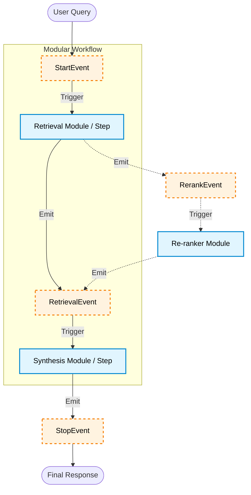

# Breaking the Monolith: Embracing Modular RAG with Workflows

In the rapidly evolving world of Large Language Models, the initial approach to Retrieval-Augmented Generation (RAG) was often monolithic. We would load our documents, build a simple index, and let a high-level wrapper handle the rest. While "Naive RAG" is fantastic for prototyping, it becomes a bottleneck as your application scales in complexity.


*Figure 1: The "black box" of standard RAG contrasted against the "Lego-brick" style of Modular RAG.*

What happens when you need to swap your vector database? Or introduce a conditionally routing agent? Or build self-correcting loops when retrieval fails?

Enter **Modular RAG**. Modular RAG isn't a single technique; it's an architectural paradigm shift. It breaks the retrieval and generation process into distinct, interoperable modules.

Recently, LlamaIndex made a huge shift to support this paradigm natively by deprecating rigid `QueryPipelines` and introducing **`Workflows`**: an event-driven framework perfect for scalable, modular RAG.

Here is a conceptual look at how an Event-Driven Workflow replaces the monolithic approach:



---

## Moving Away from the Monolith

In earlier iterations with LlamaIndex, getting a query engine up and running took three lines of code:

```python
# The Monolithic Approach
index = VectorStoreIndex.from_documents(documents)
query_engine = index.as_query_engine()
response = query_engine.query("What are the environmental goals?")
```

This is incredibly powerful, but much of the logic—how the nodes are formatted, the exact prompt being used, the ordering of operations—is hidden under the hood.

Let's break this monolith apart using LlamaIndex's event-driven **`Workflows`**.

---

## 1. Explicit Ingestion and Indexing

Instead of blindly feeding documents into an index, we explicitly define our parsing logic. This gives us the flexibility to implement custom semantic chunking, add metadata extractors, or filter nodes before they ever reach the vector database.


*Figure 2: Illustrating how a document is processed into intelligent nodes before indexing.*

```python
from llama_index.core import SimpleDirectoryReader, VectorStoreIndex
from llama_index.core.node_parser import SentenceSplitter

# Load documents
documents = SimpleDirectoryReader("data").load_data()

# Explicitly define our parsing module
splitter = SentenceSplitter(chunk_size=512, chunk_overlap=50)
nodes = splitter.get_nodes_from_documents(documents)

# Build the vector store module
index = VectorStoreIndex(nodes)
```

---

## 2. Defining Custom Events

In an event-driven architecture, components communicate by passing state via `Event` objects. We need an event to carry the retrieved context from our Retriever Module to our Synthesis Module.

```python
from llama_index.core.workflow import Event

class RetrievalEvent(Event):
    """Event containing the retrieved nodes and the original query."""
    nodes: list
    query: str
```

---

## 3. Orchestrating with Workflows

This is the heart of modern Modular RAG. We create a class inheriting from `Workflow` and use the `@step` decorator to define isolated modules that listen for and emit specific events.


*Figure 3: Reinforcing the "pub-sub" nature of LlamaIndex Workflows—where one step "shouts" an event and another "listens."*

```python
from llama_index.core.workflow import Workflow, StartEvent, StopEvent, step
from llama_index.core import PromptTemplate

class ModularRAGWorkflow(Workflow):
    def __init__(self, index, llm, *args, **kwargs):
        super().__init__(*args, **kwargs)
        self.index = index
        self.llm = llm

        # Define our Prompt Template module
        prompt_str = (
            "Context information is below.\n"
            "---------------------\n"
            "{context_str}\n"
            "---------------------\n"
            "Given the context information, answer the user's query.\n"
            "Query: {query_str}\n"
            "Answer: "
        )
        self.prompt_tmpl = PromptTemplate(prompt_str)

    @step
    async def retrieve(self, ev: StartEvent) -> RetrievalEvent:
        """Module 1: The Retrieval Step."""
        query = ev.query

        retriever = self.index.as_retriever(similarity_top_k=3)
        nodes = await retriever.aretrieve(query)

        # Emit our custom event
        return RetrievalEvent(nodes=nodes, query=query)

    @step
    async def synthesize(self, ev: RetrievalEvent) -> StopEvent:
        """Module 2: The Synthesis Step."""
        # Format the retrieved nodes into a single string
        context_str = "\n\n".join([n.get_content() for n in ev.nodes])

        # Format the prompt using our template
        formatted_prompt = self.prompt_tmpl.format(
            context_str=context_str,
            query_str=ev.query
        )

        # Call the LLM Module
        response = await self.llm.acomplete(formatted_prompt)

        # Return the final result
        return StopEvent(result=str(response))
```

To run this pipeline, we simply call:

```python
workflow = ModularRAGWorkflow(index=index, llm=Settings.llm)
result = await workflow.run(query="What are Apple's 2030 environmental goals?")
```

---

## Why Event-Driven Modular RAG Matters

The code above achieves the exact same result as the monolithic 3-line version, but it unlocks massive architectural flexibility:

1. **A/B Testing Components:** Want to test if Claude 3.5 Sonnet performs better than Gemini 1.5 Flash? Just pass a different `llm` to the workflow initialization.
2. **Easy Expansion:** Need to add a Re-ranker? Create a `@step` that listens for `RetrievalEvent`, re-scores the nodes, and emits a `RerankEvent`. Then, simply change the Synthesizer step to listen for `RerankEvent` instead!
3. **Complex Routing & Loops:** Unlike rigid DAGs, Workflows support loops. You can write a step that evaluates the LLM's answer. If it hallucinates, the step can re-emit a `StartEvent` with a modified query, triggering a self-correcting retry loop.


*Figure 4: A self-correcting loop—highlighting the non-linear nature of Workflows that allows the system to "go back" if the retrieval isn't good enough.*

Modular RAG, powered by LlamaIndex Workflows, is not just a technique; it's best practice for taking your GenAI applications from prototype to production. By defining explicit event boundaries, you create systems that are easier to test, debug, and ultimately, scale.
